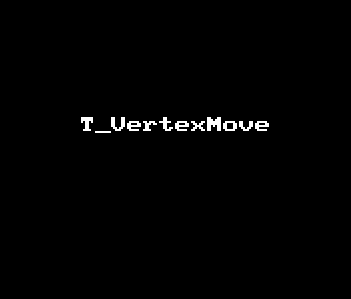

## T_VertexMoveShader 控制模型顶点移动 --by l2xin

### 效果gif



### 顶点偏移固定值
``` GLSL
v.vertex.xyz += _MaxDistance * v.normal.xyz;
```


### 时间相关
要对顶点移动做周期控制，想到正弦余弦曲线，使用`_SinTime`或者`_CosTime`.

* _Time  float4  Time (t/20, t, t*2, t*3)
* _SinTime  float4  Sine of time: (t/8, t/4, t/2, t).
* _CosTime  float4  Cosine of time: (t/8, t/4, t/2, t).

_SinTime范围为（-1，1），为实现立方体弹开又收缩回到默认，`_SinTime.w + 1`把范围限制在（0，2).
``` glsl
v.vertex.xyz += (_SinTime.w + 1) * _MaxDistance * v.normal.xyz;
```

## 参考

* [ShaderLab built-in values-https://docs.unity3d.com/462/Documentation/Manual/SL-BuiltinValues.html](https://docs.unity3d.com/462/Documentation/Manual/SL-BuiltinValues.html)
