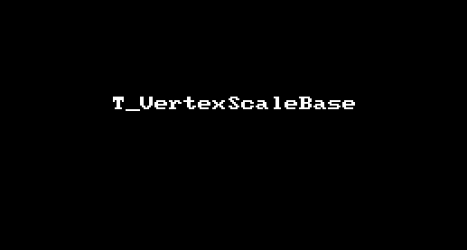
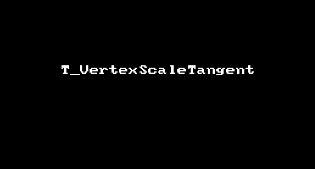

## T_VertexScaleBase & T_VertexScaleTangent 控制顶点缩放 --by l2xin

### Github
[https://github.com/l2xin/ZT_ShaderLearning/tree/master/Assets/L2xin/003_VertexScale](https://github.com/l2xin/ZT_ShaderLearning/tree/master/Assets/L2xin/003_VertexScale)

----------
## 顶点基础缩放T_VertexScaleBase


#### 效果gif



相当于模型整体缩放_MaxScale;
``` GLSL
v.vertex.xyz *= (_SinTime.w + 2) * 0.5 * _MaxScale;
```
<br>

------------
## 顶点沿切线方向缩放 T_VertexScaleTangent

#### 效果gif



#### 足球为例，由多个六边形组成，各六边形沿该平面切线方向缩放。

* $\vec{a}$为物体中心到顶点向量，即输入的v.vertex（ObjectSpace物体坐标系）；
* $\vec{b}$为顶点法线，即输入的v.normal（ObjectSpace物体坐标系）；


#### 两个辅助函数

*  $Proj_b^a=\vec{b} * \frac{\vec{a} \cdot \vec{b}} { \vec{b} \cdot \vec{b}}$
*  $Reject_b^a = \vec{a} - Proj_b^a$

``` GLSL
//计算a在b上的投影
float3 Proj(float3 a, float3 b)
{
    return (dot(a, b)/ dot(b,b)) * b;
}
```

``` GLSL
//计算切线方向
float3 Reject(float3 a, float3 b)
{
    return a - Proj(a, b);
}
```

#### Shader中顶点操作如下（两种实现一样）：

``` GLSL
float3 vertex = Proj(v.vertex, v.normal) + Reject(v.vertex, v.normal) * (_SinTime.w + 1) * 0.5;
```

``` GLSL
float3 vertex = v.vertex - Reject(v.vertex, v.normal) * (_SinTime.w + 1) * 0.5;
```
--------

## 公式推导

#### $\vec{a}在\vec{b}上的投影$推导过程如下：

$Proj_b^a = \frac{\vec{b}} {\left| \vec{b} \right|} * (\left| \vec{a} \right| * cos(\theta)) 
            = \vec{b} * \frac{(\vec{a} \cdot \vec{b})} {\left| \vec{b} \right| \cdot \left| \vec{b} \right|} 
            =\vec{b} * \frac{\vec{a} \cdot \vec{b}} { \vec{b} \cdot \vec{b}} 
            = \vec{b}*\frac{dot(\vec{a},\vec{b})}{dot(\vec{b},\vec{b})}$

-------------

## 参考

* Vscode Latex公式编辑插件-[Markdown All In One]
* [编写LaTeX数学公式-https://blog.csdn.net/fzch_struggling/article/details/44998901](https://blog.csdn.net/fzch_struggling/article/details/44998901)
