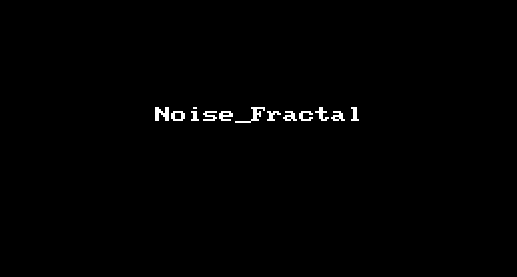
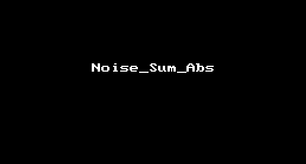
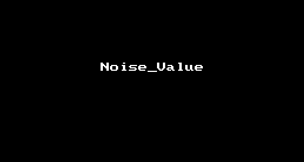
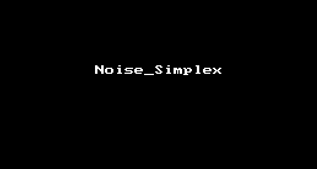
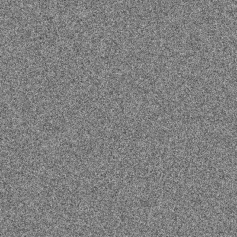

## T_VertexControlByNoise 控制模型顶点按照Nosie算法缩放位移

### Github
[https://github.com/l2xin/ZT_ShaderLearning/tree/master/Assets/L2xin/004_VertexControlByNoise](https://github.com/l2xin/ZT_ShaderLearning/tree/master/Assets/L2xin/004_VertexControlByNoise)

----------
## 效果gif

* noise_fractal
  
    

* noise_sum_abs
  
    

* value_noise
  
    

* simplex_noise
    
    

<br>

## 思路
位移和缩放的系数与normal相关，同一面上（法线方向相同）的点同一时间随机参数一致，所以，给位移和缩放加上一个Noise(normal.xy)生成出的系数：
```
float2 randInput = v.normal + (_NoiseSpeed * _Time.x);。
```
```
float2 randOutput = noise_func(randInput);。
```


## Noise算法
以上Noise算法取自[Unity Shader Example 27 (Noise)-CSDN-aa20274270](https://blog.csdn.net/aa20274270/article/details/78202471)

<br>

---------

## 噪声的基础概念

--下面是关于Noise的一段基础介绍，摘抄自Candycat的[【图形学】谈谈噪声](https://blog.csdn.net/candycat1992/article/details/50346469 )，她的文章讲的比较细，算法细节也有提到，感兴趣的可以阅读原文。

### 什么是噪声
在图形学中，我们使用噪声就是为了把一些随机变量来引入到程序中。从程序角度来说，噪声很好理解，我们希望给定一个输入，程序可以给出一个输出：

```
value_type noise(value_type p) {
    ...
}
```

它的输入和输出类型的维数可以是不同的组合，例如输入二维输出一维，输入二维输出二维等。我们今天就是想讨论一下上面函数中的实现部分是长什么样的。

### 为什么我们需要这么多噪声
噪声其实就是为了把一些随机变量引入到程序中。在我们写一些C++这样的程序时，也经常会使用random这样的函数。这些函数通常会产生一些伪随机数，但很多情况下也足够满足我们的需要。同样，在图形学中我们也经常会需要使用随机变量，例如火焰、地形、云朵的模拟等等。相信你肯定听过大名鼎鼎的Minecraft游戏，这个游戏里面的地形生成也大量使用了随机变量。那么我们直接使用random这种函数不就好了吗？为什么要引入这么多名字的噪声呢？

这种直接使用随机生成器生成的随机值固然有它的好处，但它的问题在于生成的随机值太“随机”了。在图形学中，我们可以认为这种噪声就是白噪声[White noise](https://en.wikipedia.org/wiki/White_noise)。wiki上说白噪声是功率谱密度在整个频域内均匀分布的噪声，听不懂对不对？通俗来讲，之所以称它为“白”噪声，是因为它类似于光学中包括全部可见光频率在内的白光。我相信你肯定听过白噪声，小时候电视机收音机没信号时，发出的那个沙沙声就是一种声音上的白噪声。我们这里只需要把白噪声理解为最简单的随机值，例如二维的白噪声纹理可以是下面这个样子：



可以看出白噪声非常不自然，听起来很刺耳，看起来也不好看。不光你这么想，图形学领域的前辈们也早发现了。如果你观察现实生活中的自然噪声，它们不会长成上面这个样子。例如木头纹理、山脉起伏，它们的形状大多是趋于分形状（fractal）的，即包含了不同程度的细节。比如地形，它有起伏很大的山脉，也有起伏稍小的山丘，也有细节非常多的石子等，这些不同程度的细节共同组成了一个自然的地形表面。那么，我们如何用程序来生成类似这样的自然的随机数（可以想象对应了地形不同的高度）呢？学者们根据效率、用途、自然程度（即效果好坏）等方面的衡量，提出了许多希望用程序模拟自然噪声的方法。例如，Perlin噪声被大量用于云朵、火焰和地形等自然环境的模拟；Simplex噪声在其基础上进行了改进，提到了效率和效果；而Worley噪声被提出用于模拟一些多孔结构，例如纸张、木纹等。

因此，学习和理解这些噪声在图形学中是十分必要的，因为它们的应用实在是太广泛了！

### 噪声的分类

根据wiki，由程序产生噪声的方法大致可以分为两类：

|类别|名称|
|-|-|
|基于晶格的方法（Lattice based）|又可细分为两种：第一种是梯度噪声（Gradient noise），包括Perlin噪声， Simplex噪声,Wavelet噪声等；第二种是Value噪声（Value noise）。|
|基于点的方法（Point based）|Worley噪声|

> 需要注意的是，一些文章经常会把Perlin噪声、Value噪声与分形噪声（Fractal noise）弄混，这实际在概念上是有些不一样的。分形噪声会把多个不同振幅、不同频率的octave相叠加，得到一个更加自然的噪声。而这些octave则对应了不同的来源，它可以是Gradient噪声（例如Perlin噪声）或Value噪声，也可以是一个简单的白噪声（White noise）。

> 如果读者常逛shadertoy的话，会发现很多shader使用了类似名为fbm的噪声函数。fbm实际就是分型布朗运动 *Fractal Brownian Motion*的缩写，读者可以把它等同于我们上面所说的**分形噪声（Fractal noise）**，我们以下均使用fbm来表示这种噪声的计算方法。如果要通俗地说fbm和之前提及的Perlin噪声、Simplex噪声、Value噪声、白噪声之间的联系，我们可以认为是很多个不同频率、不同振幅的基础噪声（指之前提到的Perlin噪声、Simplex噪声、Value噪声、白噪声等之一）之间相互叠加，最后形成了最终的分形噪声。这里的频率指的是计算噪声时的采样距离，例如对于基于晶格的噪声们，频率越高，单位面积（特指二维）内的晶格数目越多，看起来噪声纹理“越密集”；而振幅指的就是噪声的值域。


> Perlin噪声、Simplex噪声和Value噪声在性能上大致满足：**Perlin噪声 > Value噪声 > Simplex噪声**，Simplex噪声性能最好。Perlin噪声和Value噪声的复杂度是O(2n)O(2n)，其中n是维数，但Perlin噪声比Value噪声需要进行更多的乘法（点乘）操作。而Simplex噪声的复杂度为O(n2)O(n2)，在高纬度上优化明显。

也就是说，**分形噪声（Fractal noise）** 代表使用某种分形叠加算法把其他基础噪声叠加起来生成一个混合效果。

-------------------

## 示例中特殊语法

### 1、KeywordEnum & #pragma shader_feature

```
[KeywordEnum(Noise 1, Noise 2, Noise 3, Noise 4)]_NoiseType("NoiseType", float) = 0
```

```
#pragma shader_feature _NOISETYPE_NOISE_1 _NOISETYPE_NOISE_2 _NOISETYPE_NOISE_3 _NOISETYPE_NOISE_4
```

```
#if _NOISETYPE_NOISE_1

#elif _NOISETYPE_NOISE_2

#endif
```


也可以通过 #pragma multi_compile _NOISETYPE_NOISE_1 _NOISETYPE_NOISE_2，两者区别参考以下：

* [Making multiple shader program variants-https://docs.unity3d.com/Manual/SL-MultipleProgramVariants.html](https://docs.unity3d.com/Manual/SL-MultipleProgramVariants.html)

* [Unity Shader自定义材质面板的小技巧 - https://blog.csdn.net/candycat1992/article/details/51417965](https://blog.csdn.net/candycat1992/article/details/51417965)


-------

## 参考

* [Unity Shader Example 27 (Noise)](https://blog.csdn.net/aa20274270/article/details/78202471)
  
* [算法详解：candycat-【图形学】谈谈噪声](https://blog.csdn.net/candycat1992/article/details/50346469)
 
* [WIKI - https://en.wikipedia.org/wiki/Simplex_noise](https://en.wikipedia.org/wiki/Simplex_noise)
 
* [glsl noise algorithms ，各种噪音算法](https://blog.csdn.net/lynon/article/details/78957106)

* [Making multiple shader program variants-https://docs.unity3d.com/Manual/SL-MultipleProgramVariants.html](https://docs.unity3d.com/Manual/SL-MultipleProgramVariants.html)

* [Unity Shader自定义材质面板的小技巧 - https://blog.csdn.net/candycat1992/article/details/51417965](https://blog.csdn.net/candycat1992/article/details/51417965)
