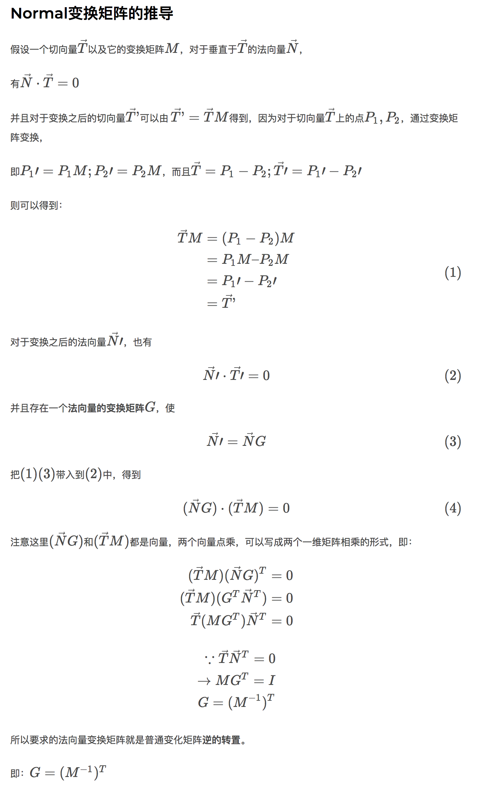

## Normal Matrix 对法向量（Normal）的变换矩阵的推导

Graphics中，用Matrix把点从一个空间转换至另一个空间是比较常见的操作，如把World Space Position转换到View Space。但是对于NonOrthogonal matrix（非正交矩阵）来说，转换之后的Normal就不垂直于它的Tangent了。

-----

推荐几篇不错的推导过程：

### 第一篇：

原文链接：[法线从object space到eye space的转换((normal matrix)](http://www.cnblogs.com/flytrace/p/3379816.html)

 

### 第二篇：

原文链接：[法向量（Normal）的变换矩阵的推导](https://www.nigauri.co/%E6%B3%95%E5%90%91%E9%87%8F%EF%BC%88normal%EF%BC%89%E7%9A%84%E5%8F%98%E6%8D%A2%E7%9F%A9%E9%98%B5%E7%9A%84%E6%8E%A8%E5%AF%BC/)

 

### 第三篇：

原文链接：[Tutorials » GLSL 1.2 Tutorial » The Normal Matrix](http://www.lighthouse3d.com/tutorials/glsl-12-tutorial/the-normal-matrix/)